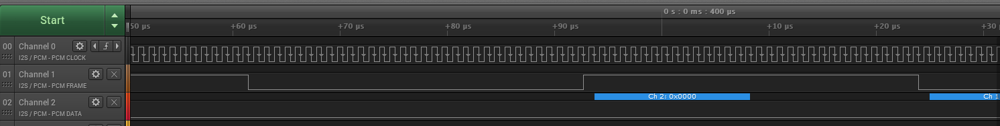
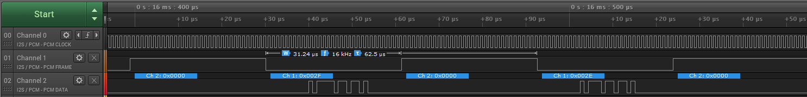

First, load up your favourite Linux flavour for your Raspberry Pi.  Here I use Arch Linux since it installs a bare minimum for access via an SSH terminal and leaves the rest to you, but you may adapt the installation described here to whatever Linux distribution you choose.

INSTALL ARCH LINUX
==================
Follow the installation instructions here (you will need a Linux machine from which to perform the installation onto the Raspberry Pi SD card; if you don't have one you can temporarily boot your Windows PC into Linux from a USB stick for this purpose):

https://archlinuxarm.org/platforms/armv7/broadcom/raspberry-pi-2

Once done you should be logged into an SSH prompt on the Raspberry Pi.

CONFIGURE ARCH LINUX
====================
Become root with:

`su`

(the default root password is `root`).

Upgrade the whole system with:

`pacman -Syu`

...entering `y` to the prompts that arise.

Change the root password with the command:

`passwd`

Use `nano` to edit `/etc/hostname` and change `alarm` to a unique name, e.g. `ioc`.

Use `nano` to edit the `/etc/hosts` file to reflect that `hostname`, modifying the line of the file to read:

`127.0.0.1 localhost.localdomain localhost yourhostname`

...where `yourhostname` is replaced by the name you put in `/etc/hostname`.

Switch the swap file off by entering:

`swapoff -a`

Install sudo:

`pacman -S sudo`

Give your regular user permission to use `sudo` by editing the configuration file `visudo` as follows:

`EDITOR=nano visudo`

Locate the section marked as:

```
##
## User privilege specification
##
```

...and uncomment the line a few lines below this to say:

`%wheel ALL=(ALL) ALL`

...and the one below that to say:

`%wheel ALL=(ALL) NOPASSWD: ALL`

...and the one below that to say:

`%sudo    ALL=(ALL) ALL`

...and the one below that to say:

`ALL ALL=(ALL) ALL  # WARNING: only use this together with 'Defaults targetpw'`

Add a user (in this example `ioc`) by entering the following:

`useradd -m -G wheel ioc`

Create a password for this user with:

`passwd ioc`

Log out and log in again as this user.  From now on `sudo` all commands as necessary.

Remove the old `alarm` user with:

`userdel -r alarm`

Get the ntp package:

`pacman -S ntp`

You will also need the policy kit to set the timezone:

`pacman -S polkit`

Reboot the Raspberry Pi (this is apparently required for `polkit` or you will get an `Access Denied` error).

Enable the service and switch NTP on with:

```
systemctl enable ntpd.service
timedatectl set-ntp 1
```
Now set the timezone:

`timedatectl set-timezone Europe/London`

Install a load of useful packages with:

`pacman -S bash-completion lrzsz picocom minicom unzip wget git fakeroot`

Install `vsftpd` with:

`pacman -S vsftpd`

Get permissions correct with:

`chown root /etc/vsftpd.conf`

Make sure that `/etc/vsftpd.conf` includes the line:

`listen=YES`

...and restart the service:

`systemctl restart vsftpd`

Check that you can get a response from the ftp server by entering:

`ftp 127.0.0.1`

You should get something like:

```
Connected to 127.0.0.1.
220 (vsFTPd 3.0.2)
Name (127.0.0.1:ioc):
```
Type `quit` and press enter to leave ftp.

Then edit `/etc/vsftpd.conf` to disable anonymous FTP (`anonymous_enable=NO`), allow local users to log in (`local_enable=YES`) and enable writing (`write_enable=YES`).   Restart the `vsfptd` service once more and check that you can log into the FTP server from somewhere else as the user `ioc`.

Set `vsftpd` to start at boot by entering:

`systemctl enable vsftpd`

CONFIGURE I2S
=============
Configuration of the I2S interface on the Raspberry Pi is based on the instructions that can be found here:

http://www.raspberrypi.org/forums/viewtopic.php?f=44&t=91237

Edit `/boot/config.txt` to add the lines:

```
dtparam=audio=on
dtparam=i2s=on
```

Edit `/etc/modules-load.d/raspberrypi.conf` to add the line:

`bcm2708_dmaengine`

BUILD AND LOAD THE ICS43432 MICROPHONE DRIVER
=============================================
Next we need to build and load the ICS43432 microphone driver.  This is already available as part of the Linux source tree but is not built or loaded by default.

These steps are based on this blog post:

https://www.raspberrypi.org/forums/viewtopic.php?t=173640

... along with this post on how to compile a kernel module for ARCH Linux:

https://wiki.archlinux.org/index.php/Compile_kernel_module

First, prepare yourself for development by downloading all the recommended development packages for Arch Linux:

`pacman -S base-devel xmlto docbook-xsl kmod inetutils bc`

Determine your Linux kernel version with:

`uname -r`

My kernel version was `4.9.78-1-ARCH` in which `4.9.78` is the Linux version number; substitute *your* Linux version number where you see the text `<LINUXVER>` in the remainder of these instructions (e.g. in my case `<LINUXVER>` is replaced with `4.9.78`).

Download the kernel source into a build directory then unpack it and clean it with:

```
mkdir ~/kernelbuild
cd ~/kernelbuild
wget https://www.kernel.org/pub/linux/kernel/v4.x/linux-<LINUXVER>.tar.xz
tar -xvJf linux-<LINUXVER>.tar.xz
cd linux-<LINUXVER>
make mrproper
```
[Note: in the `wget` line `v4.x` assumes your Linux version number begins with a 4].

Create the requisite Arch Linux kernel configuration for the system with:

```
zcat /proc/config.gz > .config
make oldconfig
```
If you now look in the `sound/soc/codecs` directory you should see a file called `ics43432.c`.  And if you look in the file `sound/soc/codecs/Kconfig` you will find in it a configuration called `SND_SOC_ICS43432`; find the same string in the `.config` line that was created above.  It will say:

`# CONFIG_SND_SOC_ICS43432 is not set`

Edit the line to become:

`CONFIG_SND_SOC_ICS43432=m`

When preparing the module list from this configuration file you also need to set `EXTRAVERSION`.  That's usually `-1`, as you can see in my case above; the bit between the Linux version number `4.9.78` and `-ARCH`.  Once you have determined this prepare the module list as follows (in my case `<YOUR EXTRAVERSION HERE>` is replaced with `-1` (no quotes)):

`make EXTRAVERSION=<YOUR EXTRAVERSION HERE> modules_prepare`

Now build the codecs module with:

`make M=sound/soc/codecs`

Look in the `sound/soc/codecs` directory again and you should now see the file `snd-soc-ics43432.ko`.

Install it with:

```
gzip sound/soc/codecs/snd-soc-ics43432.ko
cp sound/soc/codecs/snd-soc-ics43432.ko.gz /usr/lib/modules/``uname -r``/extramodules/
```
Try adding the module manually with:

`insmod /usr/lib/modules/``uname -r``/extramodules/snd-soc-ics43432.ko.gz`

If this fails with the error `Could not insert module, invalid module format` then you've downloaded the wrong version of Linux kernel source for the Linux binary you are using and you need to repeat this section using the correct Linux kernel source version.

NOTE: when you do `pacman Syu` this might happen again if the Linux version changes as a result, so you must always check (by using `uname -r`) after each `pacman -Syu`; if the version has changed you need to re-download the Linux source with the correct version and repeat the actions of this section from the start to build a compatible `snd-soc-ics43432.ko` file.

Finally, to load the module at boot, create a file named something like `ics43432.conf` with contents:

```
# Driver for the ICS43432 I2S microphone
snd-soc-ics43432
```
...and place it in the directory `/etc/modules-load.d`.

Reboot and use `lsmod` to check that the driver has been automatically loaded.

If it is not loaded, check what went wrong during boot using `dmesg`.

Now we need to create a device tree entry to make use of this driver.  First install the Device Tree Compiler as follows:

`pacman -S dtc`

Create a file `i2s-soundcard-overlay.dts` with this content:

```
/dts-v1/;
/plugin/;

/ {
    compatible = "brcm,bcm2708";

    fragment@0 {
        target = <&i2s>;
        __overlay__ {
            status = "okay";
        };
    };

    fragment@1 {
        target-path = "/";
        __overlay__ {
            card_codec: card-codec {
                #sound-dai-cells = <0>;
                compatible = "invensense,ics43432";
                status = "okay";
            };
        };
    };

    fragment@2 {
        target = <&sound>;
        master_overlay: __dormant__ {
            compatible = "simple-audio-card";
            simple-audio-card,format = "i2s";
            simple-audio-card,name = "soundcard";
            simple-audio-card,bitclock-master = <&dailink0_master>;
            simple-audio-card,frame-master = <&dailink0_master>;
            status = "okay";
            simple-audio-card,cpu {
                sound-dai = <&i2s>;
            };
            dailink0_master: simple-audio-card,codec {
                sound-dai = <&card_codec>;
            };
        };
    };

    fragment@3 {
        target = <&sound>;
        slave_overlay: __overlay__ {
                compatible = "simple-audio-card";
                simple-audio-card,format = "i2s";
                simple-audio-card,name = "soundcard";
                status = "okay";
                simple-audio-card,cpu {
                    sound-dai = <&i2s>;
                };
                dailink0_slave: simple-audio-card,codec {
                    sound-dai = <&card_codec>;
                };
        };
    };

    __overrides__ {
        alsaname = <&master_overlay>,"simple-audio-card,name",
                    <&slave_overlay>,"simple-audio-card,name";
        compatible = <&card_codec>,"compatible";
        master = <0>,"=2!3";
    };
};
```
Compile and install this as follows:

```
dtc -@ -I dts -O dtb -o i2s-soundcard.dtbo i2s-soundcard-overlay.dts
cp i2s-soundcard.dtbo /boot/overlays
```
[Note: ignore the warnings that the dtc compilation process throws up].

Finally, edit the file `/boot/config.txt` to append the line:

`dtoverlay=i2s-soundcard,alsaname=mems-mic`

Install ALSA with:

`pacman -S alsa-utils alsa-firmware alsa-lib alsa-plugins`

Add the user (in our case `ioc`) to the audio group to avoid any permissions problems:

`usermod -a -G audio ioc`

Now reboot and then check for sound cards with:

`arecord -l`

...and you should see:

```
**** List of CAPTURE Hardware Devices ****
card 1: memsmic [mems-mic], device 0: bcm2835-i2s-ics43432-hifi ics43432-hifi-0 []
  Subdevices: 1/1
  Subdevice #0: subdevice #0
```
The output from `lsmod` should now look something like this:

```
Module                  Size  Used by
snd_soc_bcm2835_i2s     6745  2
snd_soc_simple_card     5509  0
snd_soc_simple_card_utils     4423  1 snd_soc_simple_card
bcm2835_gpiomem         3515  0
bcm2835_rng             2679  0
rng_core                7676  1 bcm2835_rng
uio_pdrv_genirq         3456  0
uio                     9072  1 uio_pdrv_genirq
fixed                   2921  0
sch_fq_codel            9358  2
snd_bcm2835            21570  0
snd_soc_ics43432        2050  1
snd_soc_core          157891  4 snd_soc_ics43432,snd_soc_simple_card_utils,snd_soc_bcm2835_i2s,snd_soc_simple_card
snd_compress            9500  1 snd_soc_core
snd_pcm_dmaengine       4847  1 snd_soc_core
snd_pcm                87826  4 snd_pcm_dmaengine,snd_soc_bcm2835_i2s,snd_bcm2835,snd_soc_core
snd_timer              21638  1 snd_pcm
snd                    60574  5 snd_compress,snd_timer,snd_bcm2835,snd_soc_core,snd_pcm
ip_tables              12235  0
x_tables               17324  1 ip_tables
ipv6                  387315  48
```
CONNECT AN ICS43432 MEMS MICROPHONE
===================================
The pins you need on the Raspberry Pi header are as follows:

* Pin 12: I2S clock
* Pin 35: I2S frame
* Pin 20: I2S data in
* Pin 39: ground
* Pin 1:  3.3V
* [Pin 21: I2S data out]

If you want to confirm that all is good, attach an oscilloscope or logic analyser to the pins and activate the pins by requesting a 10 second long recording with:

`arecord -Dhw:1 -c2 -r16000 -fS32_LE -twav -d10 -Vstereo test.wav`

You should see something like this:



Connect up your ICS43432 MEMS microphone, with the LR select pin grounded, and you should see data flowing something like this:



To make a proper capture you will need to configure for a mono microphone and a sensible level.  In your home directory create a file called `.asoundrc` with the following contents:

```
pcm.mic_hw {
    type hw;
    card memsmic;
    channels 2;
    format S32_LE;
}
pcm.mic_mm {
    type mmap_emul;
    slave.pcm mic_hw;
}
pcm.mic_sv{
    type softvol;
    slave.pcm mic_mm;
    control {
        name "Boost Capture Volume";
        card memsmic;
    }
    min_dB -3.0;
    max_dB 50.0;
}
pcm.mic_mono {
    type multi;
    slaves.a.pcm mic_sv;
    slaves.a.channels 2;
    bindings.0.slave a;
    bindings.0.channel 0;
}
```
Check that your configuration is correct by making a recording with this newly defined device:

`arecord -Dmic_sv -c2 -r16000 -fS32_LE -twav -d10 -Vstereo test.wav`

Now run `alsamixer`, call up the menu by pressing F6, select `mems-mic` and then press the TAB key to set the capture levels (you can try using F4 instead but that is often grabbed by the terminal program and hence may do other things).  Use the arrow keys to set a boost of around 30 dB and press ESC to exit.

Now run another recording and, hopefully, you will get audible sound in your `test.wav` file.
